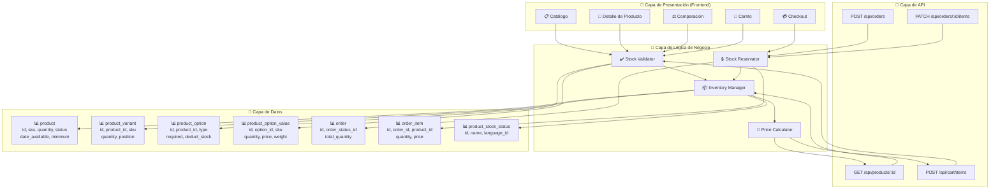
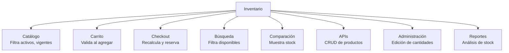

# Diagrama: Arquitectura del Módulo - Gestión de Inventario

## Descripción

Este diagrama muestra la arquitectura del módulo de Gestión de Inventario, sus componentes, entidades de base de datos y relaciones.

---

## Arquitectura de Componentes



---

## Entidades de Base de Datos

### 📊 product
```
+------------------+----------+-----+
| Campo            | Tipo     | FK  |
+------------------+----------+-----+
| id               | INT      | PK  |
| sku              | VARCHAR  |     |
| quantity         | INT      |     |
| status           | BOOLEAN  |     |
| date_available   | DATE     |     |
| minimum          | INT      |     |
| stock_status_id  | INT      | FK  |
+------------------+----------+-----+

Nota: quantity=0 usa stock_status_id para estado
```

### 📊 product_variant
```
+------------------+----------+-----+
| Campo            | Tipo     | FK  |
+------------------+----------+-----+
| id               | INT      | PK  |
| product_id       | INT      | FK  |
| sku              | VARCHAR  |     |
| quantity         | INT      |     |
| position         | INT      |     |
+------------------+----------+-----+

Nota: Variante hereda status y date_available del maestro
```

### 📊 product_option
```
+------------------+----------+-----+
| Campo            | Tipo     | FK  |
+------------------+----------+-----+
| id               | INT      | PK  |
| product_id       | INT      | FK  |
| type             | VARCHAR  |     |
| required         | BOOLEAN  |     |
| deduct_stock     | BOOLEAN  |     |
| sort_order       | INT      |     |
+------------------+----------+-----+

Tipos: select, radio, checkbox, text, textarea, file, date, datetime, time
```

### 📊 product_option_value
```
+------------------+----------+-----+
| Campo            | Tipo     | FK  |
+------------------+----------+-----+
| id               | INT      | PK  |
| option_id        | INT      | FK  |
| sku              | VARCHAR  |     |
| quantity         | INT      |     |
| price            | DECIMAL  |     |
| weight           | DECIMAL  |     |
| sort_order       | INT      |     |
+------------------+----------+-----+

Nota: Se valida si deduct_stock=true en option
```

### 📊 order
```
+------------------+----------+-----+
| Campo            | Tipo     | FK  |
+------------------+----------+-----+
| id               | INT      | PK  |
| order_status_id  | INT      | FK  |
| total_quantity   | INT      |     |
| date_added       | DATETIME |     |
+------------------+----------+-----+

Nota: total_quantity suma de todas las líneas
```

### 📊 order_item
```
+------------------+----------+-----+
| Campo            | Tipo     | FK  |
+------------------+----------+-----+
| id               | INT      | PK  |
| order_id         | INT      | FK  |
| product_id       | INT      | FK  |
| quantity         | INT      |     |
| price            | DECIMAL  |     |
+------------------+----------+-----+

Nota: product_id referencia producto o variante
```

### 📊 product_stock_status
```
+------------------+----------+-----+
| Campo            | Tipo     | FK  |
+------------------+----------+-----+
| id               | INT      | PK  |
| name             | VARCHAR  |     |
| language_id      | INT      | FK  |
+------------------+----------+-----+

Valores típicos: "En stock", "No disponible", "Disponibilidad limitada"
```

---

## Flujo de Datos

```mermaid
graph LR
    A["📋 Usuario en Catálogo"]
    B["🔍 Inventory Manager<br/>carga producto"]
    C["✔️ Stock Validator<br/>verifica disponibilidad"]
    D["📊 product, variant,<br/>option, option_value"]
    E["✅ Resultado:<br/>Disponible/No disponible"]
    F["📱 Frontend renderiza<br/>botón de compra"]
    
    A --> B
    B --> C
    B --> D
    C --> D
    C --> E
    E --> F
    
    G["🛒 Usuario agrega al carrito"]
    H["✔️ Stock Validator<br/>valida cantidad total"]
    I["📊 Consulta carrito +<br/>stock disponible"]
    J["✅ Agregar al carrito"]
    
    F --> G
    G --> H
    H --> I
    I --> J
    
    K["💳 Usuario en checkout"]
    J --> K
    K --> L["🔒 Stock Reservator<br/>recalcula stock"]
    L --> M["📊 Valida cambios<br/>de stock"]
    N["💳 Usuario confirma orden"]
    M --> N
    
    N --> O["🔒 Stock Reservator<br/>reserva stock final"]
    O --> P["📊 order + order_item<br/>inserta registro"]
    P --> Q["🧮 Price Calculator<br/>precio final"]
    Q --> R["📧 Confirmación enviada"]
```



---

## Componentes Clave

### 📦 Inventory Manager
**Responsabilidad**: Gestión centralizada de inventario
- Cargar datos de producto, variantes, opciones
- Calcular stock disponible considerando variantes
- Manejar stock_status cuando quantity=0

### ✔️ Stock Validator
**Responsabilidad**: Validar disponibilidad de stock
- Verificar cantidad disponible vs cantidad requerida
- Validar opciones con descuento de inventario
- Validar cantidades mínimas
- Generar mensajes de error estructurados

### 🔒 Stock Reservator
**Responsabilidad**: Reservar y confirmar stock
- Crear reservas al iniciar checkout
- Liberar reservas si se cancela
- Restar stock al confirmar orden
- Actualizar orden_item con quantities

### 🧮 Price Calculator
**Responsabilidad**: Calcular precios finales
- Sumar precio base + opciones
- Acumular puntos
- Acumular peso
- Considerar descuentos aplicables

---

## Integraciones



---

## Configuraciones del Módulo

```
config_stock:
  ├── allow_out_of_stock (bool) — Permitir venta sin stock
  ├── show_stock_catalog (bool) — Mostrar cantidad en catálogo
  ├── show_stock_compare (bool) — Mostrar en comparación
  ├── stock_display_type (enum) — 'quantity' | 'status' | 'both'
  └── stock_status_id (int) — Estado por defecto cuando qty=0

config_checkout:
  ├── require_minimum_qty (bool) — Validar cantidad mínima
  └── reserved_stock_ttl (int) — Tiempo de reserva en minutos
```

---

## Seguridad y Validación

- ✅ **Validación en BD**: Constraints para cantidad >= 0
- ✅ **Validación en API**: Errores estructurados por product_id/option_id
- ✅ **Transacciones ACID**: Restar stock en transacción
- ✅ **Auditoría**: Log de cambios de stock
- ✅ **Concurrencia**: Locks pessimistas en confirmación
