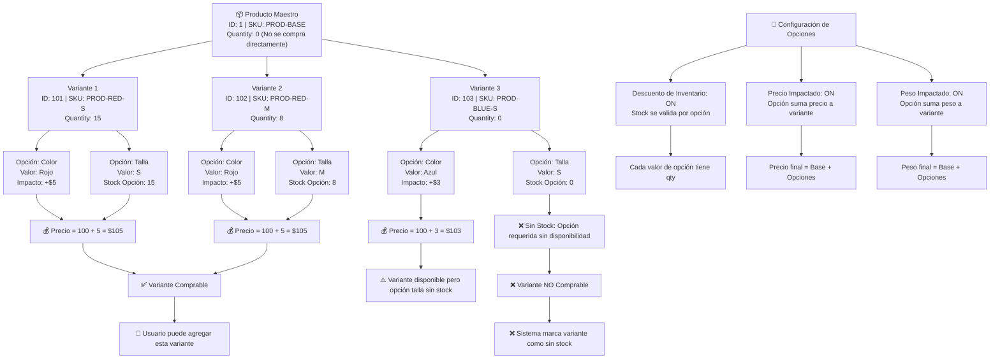
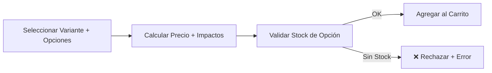

# Diagrama: Estructura de Variantes y Opciones - Gestión de Inventario

## Descripción

Este diagrama muestra las relaciones entre producto maestro, variantes, opciones y cómo impactan en el inventario del sistema.

---

## Estructura de Variantes y Opciones



---

## Relaciones Clave

### Jerarquía de Productos

```
Producto Maestro
├── Variante 1
│   ├── Opción 1 (Color)
│   └── Opción 2 (Talla)
├── Variante 2
│   ├── Opción 1 (Color)
│   └── Opción 2 (Talla)
└── Variante 3
    ├── Opción 1 (Color)
    └── Opción 2 (Talla)
```

### Stock en Diferentes Niveles

| Nivel | Stock | Validación | Nota |
|---|---|---|---|
| **Producto Maestro** | 0 | No se valida (no se compra) | Solo gestión administrativa |
| **Variante** | 15, 8, 0 | Se valida al comprar variante | Cantidad de la variante específica |
| **Opción/Valor** | 15, 8, 0 | Se valida si descuento activo | Stock por cada valor de opción |

### Impacto en Precio, Puntos y Peso

```
Precio Final = Precio Base + Suma de Opciones
Puntos Final = Puntos Base + Suma de Opciones
Peso Final = Peso Base + Suma de Opciones

Ejemplo:
- Base: Precio=$100, Puntos=50, Peso=1kg
- Opción Talla M: +$10, +5pts, +0.5kg
- Opción Color Rojo: +$5, +0pts, +0kg
- Final: Precio=$115, Puntos=55, Peso=1.5kg
```

---

## Escenarios de Validación

### ✅ Variante Comprable
- Variante tiene `quantity > 0`
- Todas las opciones requeridas tienen stock (si descuento activo)
- Estado de variante es activo

### ⚠️ Variante Parcialmente Disponible
- Variante tiene cantidad
- Una opción requerida sin stock
- Resultado: **Sin stock** (marca toda la variante como no disponible)

### ❌ Variante No Comprable
- Variante sin cantidad (`quantity = 0`)
- O todas sus opciones requeridas sin stock
- O variante desactivada

---

## Integración con Carrito



---

## Configuraciones de Opciones

- **Tipo Select**: Dropdown, cada valor con stock independiente
- **Tipo Radio**: Botones, cada valor con stock independiente
- **Tipo Checkbox**: Casillas múltiples, cada valor con stock independiente
- **Descuento de Inventario**: Si está ON, resta stock de la opción, no solo del producto
- **Impacto de Precio/Peso/Puntos**: Se suma al precio base según configuración
