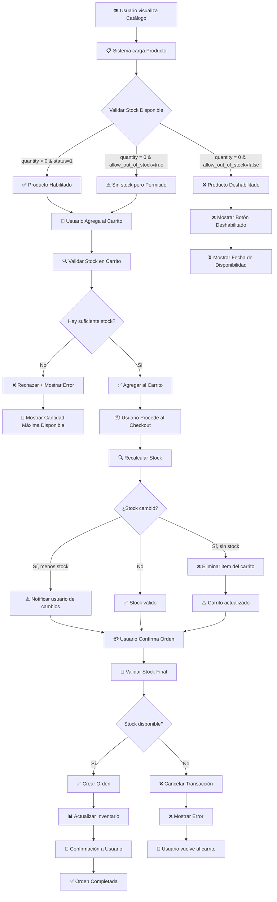

# Diagrama: Flujo de Stock - Gestión de Inventario

## Descripción

Este diagrama muestra cómo se valida y actualiza el stock desde que el usuario visualiza un producto en el catálogo hasta la confirmación de la compra.

---

## Flujo de Stock

---

## Puntos Clave

1. **Validación en Catálogo**: Se verifica `quantity` y `status` antes de permitir compra
2. **Validación en Carrito**: Se valida cantidad total de items del mismo producto
3. **Validación en Checkout**: Se recalcula stock considerando cambios durante la sesión
4. **Validación en Confirmación**: Último control antes de restar inventario
5. **Actualización**: Stock se resta solo tras confirmación exitosa
6. **Configuración**: `allow_out_of_stock` determina si se permite venta sin stock

---

## Escenarios Cubiertos

- ✅ Producto con stock disponible
- ✅ Producto sin stock pero venta permitida
- ✅ Producto sin stock y venta no permitida
- ✅ Stock insuficiente en carrito
- ✅ Cambios de stock durante checkout
- ✅ Validación final antes de confirmación
- ✅ Producto con fecha de disponibilidad futura
