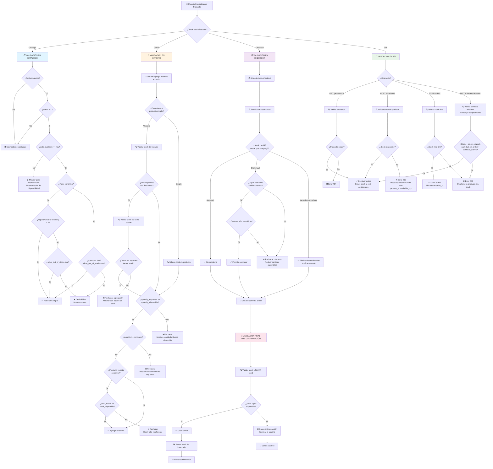

# Diagrama: Procesos de Validación - Gestión de Inventario

## Descripción

Este diagrama presenta un árbol de decisiones completo para todas las validaciones de stock en diferentes puntos del sistema.

---

## Árbol de Decisiones de Validación



---

## Matriz de Validación por Punto

| Punto | Valida | Stock | Cantidad | Mínimo | Opciones | Resultado |
|---|---|---|---|---|---|---|
| **Catálogo** | Existencia, Status, Fecha, Variantes | ✅ | ❌ | ❌ | ✅ (disponibilidad) | Habilitar/Deshabilitar |
| **Carrito** | Existencia, Variante, Stock, Cantidad total | ✅ | ✅ | ✅ | ✅ (cada valor) | Agregar/Rechazar |
| **Checkout** | Cambios de stock, Disponibilidad actual | ✅ | ✅ | ✅ | ✅ | Continuar/Notificar |
| **Confirmación** | Validación final antes de restar stock | ✅ | ✅ | ✅ | ✅ | Crear orden/Cancelar |
| **API** | Según endpoint (GET/POST/PATCH) | ✅ | ✅ | ✅ | ✅ | 200/400/404 |

---

## Flujos Críticos

### 🔴 Flujo: Stock Insuficiente
```
Usuario agrega → Stock validado ✅ → Stock baja durante checkout → 
Validación en checkout ❌ → Notificar → Usuario decide → Volver a carrito
```

### 🟡 Flujo: Opción sin Stock
```
Usuario selecciona opción → Opción sin stock ❌ → Error específico de opción → 
Usuario selecciona otra opción → Validar nueva opción ✅ → Agregar
```

### 🟢 Flujo: Compra Exitosa
```
Catálogo ✅ → Carrito ✅ → Checkout ✅ → Confirmación ✅ → 
Orden creada → Stock restado → Confirmación enviada
```

---

## Puntos de Tolerancia

### Stock reservado en órdenes pendientes
- Al crear orden, stock se reserva
- Si orden se cancela, stock se libera
- PATCH en orden considera stock ya comprometido

### Cambios concurrentes
- Si dos usuarios compran simultáneamente el último item
- El primero que confirma logra la compra
- El segundo recibe error en validación final

### Configuración de tiempo de vida de carrito
- Carrito se valida al iniciar checkout
- Carrito se valida nuevamente antes de confirmar
- Carrito desactualizado se notifica al usuario
